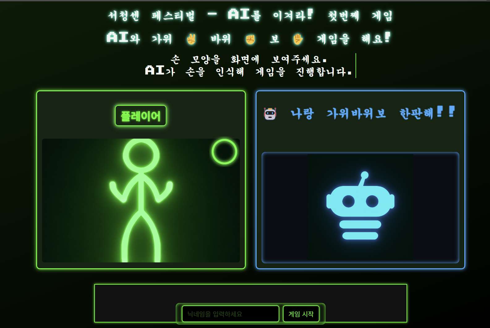

##배포 주소
https://whoisthewinnerofthisgame.netlify.app/

## 🧰 Tech Stack

- **Frontend**: HTML5, SCSS, Vanilla JavaScript (ES6)
- **Build Tool**: Webpack
- **AI Model**: Google Teachable Machine (Image Classification)
- **Libraries**:
  - [`howler.js`](https://github.com/goldfire/howler.js): Sound effects
  - TensorFlow.js-based gesture prediction
  - PostCSS, SASS for style preprocessing

---

Features
Real-time hand gesture detection (via webcam)

AI opponent using random moves

Visual feedback with flashing effects for win/loss

Sound effects for actions and results

Designed for young students / children

Optimized layout for classroom and exhibition environments
 
  
<h1>HOW to run</h1>

1. Node.js, npm 설치

2. 프로젝트 clone
(git bash 창에서)
<code>
   git clone https://github.com/flying-adventure/rockscissiorspaper.git
   cd RockScissiosPaper_TeachableMachine
   npm install
   npm run start
</code>
<h2>And go to http://localhost:8080</h2>

